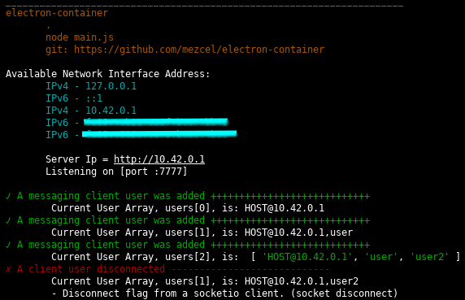
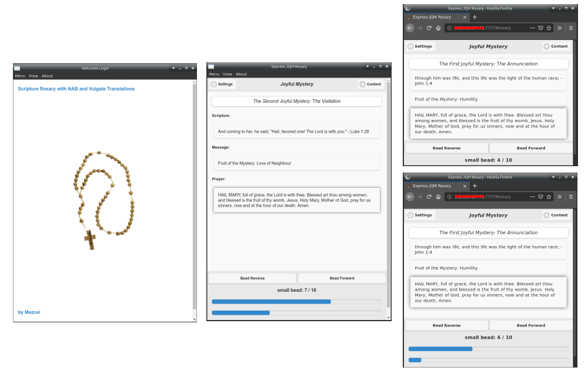
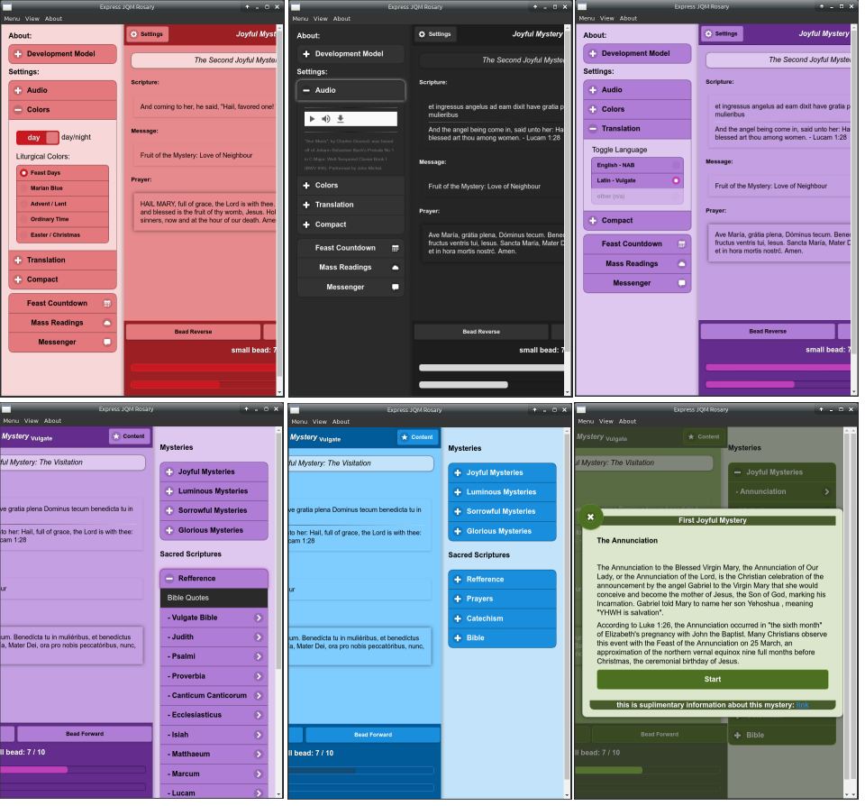
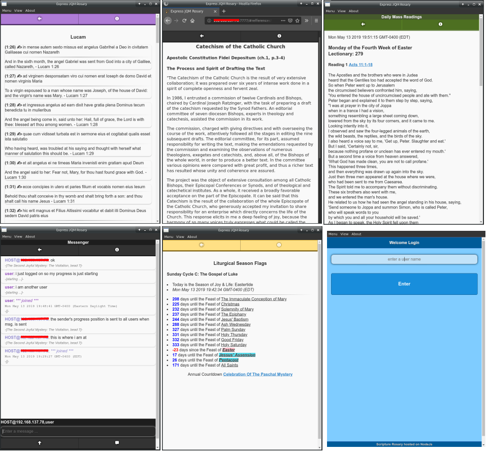

## readme

#### Collage of Screenshots

A mixture of Electron and Firefox clients.

Screenshots were taken on Arch linux running a GTK environment with the compositor turned off.

For this app, Win10 and iOS have the best client experience, but I hosted my demo on a Arch linux server for the purposes of illustrating the multi-user functionality.

---

### Node Server Terminal

### Primary Requirements Interface (Electron and Firefox)

### Features Interface (Right/Left Panel)

### Additional Content

